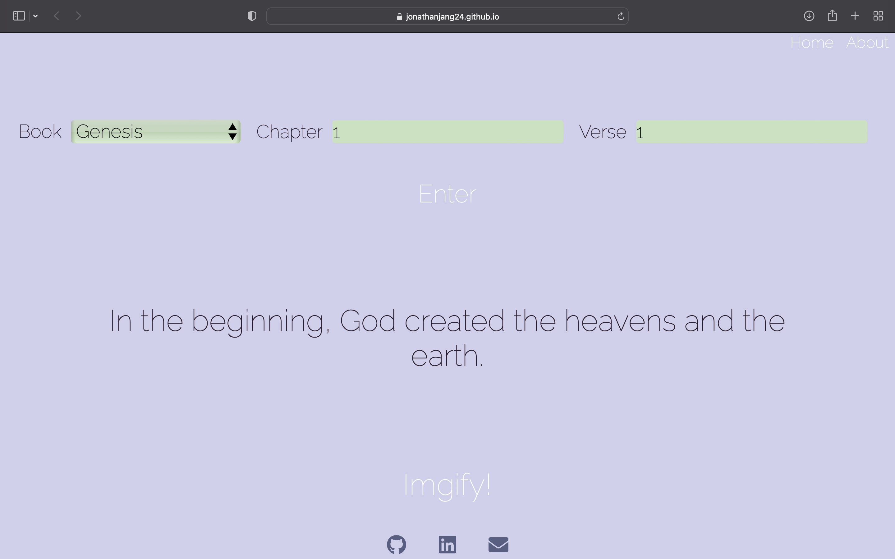
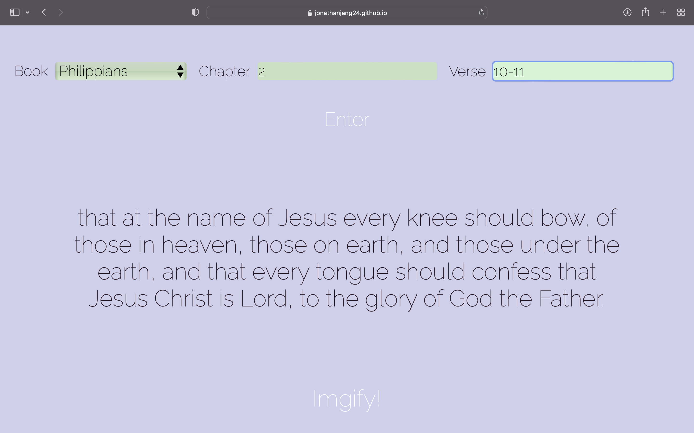
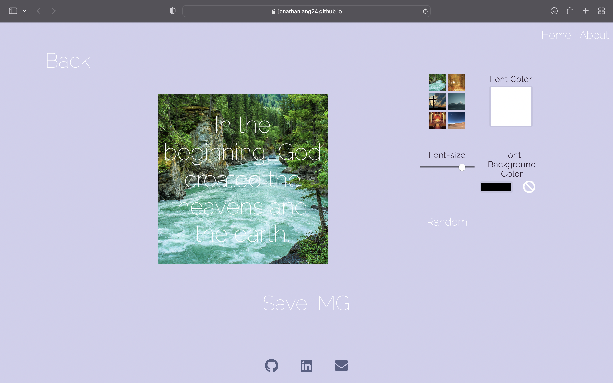
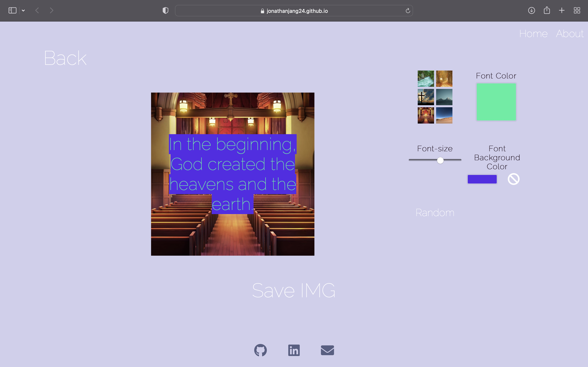

# Bible Verse Imgifier

## Description
A react web app that converts bible verses to downloadable .png files with customization of background images, font colors, background font colors, and font size, all natively done with react hooks.

## Usage

The user is initially met with the home screen, allowing for selection of a particular verse(s).    

Selecting a range of verses in a particular chapter

Upon clicking the "Imgify!" button seen at the bottom of the home page (see previous image), the app will take you to the following page:

Users can then choose particular options to customize their image, or try clicking 'random' to generate a randomized image.

## Technologies
- React.JS
- JSON API
- JS localStorage
- HTML
- CSS

## Dependencies
- react-router-dom
- react-component-export-image
- react-icons

***Visit the page at:***
https://jonathanjang24.github.io/bible-verse-imgify/
